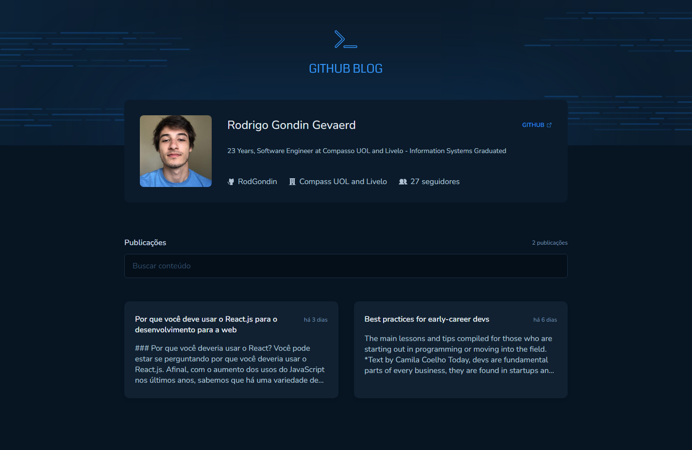
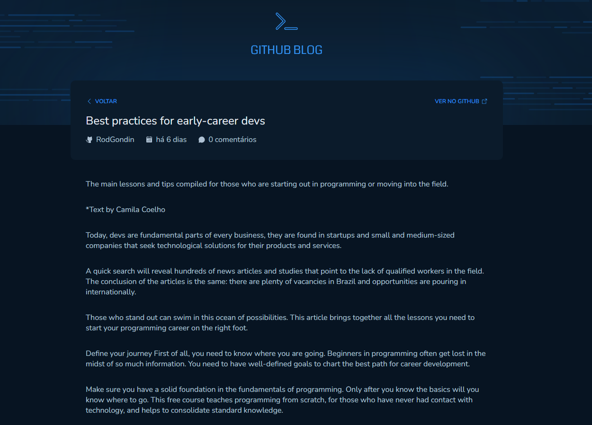

# GitHub Blog

Este projeto é um desafio proposto pela @Rocketseat, a aplicação de blog que consome dados da API do GitHub, exibindo informações de perfil do usuário, issues de repositórios e permitindo a navegação entre as issues detalhadas. A interface é estilizada para uma aparência moderna e responsiva, com uma navegação suave entre as páginas.

---

## Imagens de Demonstração





---

## Funcionalidades

- **Exibir perfil do GitHub**: Mostra informações como nome, empresa, seguidores e biografia do usuário.
- **Listar issues**: Busca issues de um repositório do GitHub e as exibe como publicações no blog.
- **Visualizar issue detalhada**: Ao clicar em uma issue, os detalhes completos são exibidos, com o corpo formatado em Markdown.
- **Barra de pesquisa**: Possibilidade de pesquisar issues por palavra-chave.
- **Navegação fluida**: Uso de rotas dinâmicas com `react-router-dom` para navegação entre as páginas.

## Tecnologias Utilizadas

- **React**: Biblioteca JavaScript usada para criar a interface de usuário.
- **TypeScript**: Linguagem usada no projeto para adicionar tipagem estática ao JavaScript, tornando o código mais confiável.
- **Styled Components**: Biblioteca para estilização com CSS-in-JS, permitindo estilos dinâmicos baseados em temas e propriedades.
- **React Router DOM**: Gerenciamento de rotas, permitindo a navegação entre páginas como Home e página de detalhes de issues.
- **Axios**: Biblioteca para fazer requisições HTTP, utilizada para consumir a API do GitHub.
- **React Markdown**: Biblioteca usada para converter e renderizar o conteúdo das issues em formato Markdown.
- **Phosphor Icons**: Conjunto de ícones personalizáveis usados na interface.
- **GitHub API**: API consumida para buscar dados do usuário e das issues.

## Instalação

Para rodar o projeto localmente, siga os passos abaixo:

1. Clone o repositório:

   ```bash
   git clone https://github.com/RodGondin/Github-blog.git
   ```

2. Entre na pasta do projeto:

   ```bash
   cd Github-blog
   ```

3. Instale as dependências:

   ```bash
   npm install
   ```

4. Crie um arquivo `.env` na raiz do projeto com a seguinte variável de ambiente, caso queira mais até 30 requisições por minuto:

   ```bash
   VITE_GITHUB_TOKEN=seu_token_do_github
   ```

   Esse token pode ser obtido [aqui](https://github.com/settings/tokens), e permite realizar requisições autenticadas à API do GitHub, aumentando o limite de requisições.

5. Inicie o servidor de desenvolvimento:

   ```bash
   npm run dev
   ```

6. Abra o navegador e acesse:

   ```
   http://localhost:5173
   ```

## Estrutura de Diretórios

```
.github/                   # Configurações relacionadas ao GitHub
node_modules/               # Pacotes instalados pelo npm
public/                     # Arquivos públicos (favicon, etc.)
src/                        # Código-fonte do projeto
│
├── assets/                 # Arquivos estáticos (imagens, fontes, etc.)
├── components/             # Componentes reutilizáveis
│   ├── Header/             # Componente de cabeçalho
│   └── IssueCard/          # Componente de card de issue
│
├── contexts/               # Contexto para gerenciar estado global (Issues e User)
│   └── IssuesContext.tsx   # Contexto que gerencia os dados de issues e do perfil do usuário
│
├── lib/                    # Configuração de bibliotecas, como Axios
│   └── axios.ts            # Configuração do Axios com baseURL e headers
│
├── pages/                  # Páginas da aplicação
│   ├── Home/               # Página inicial (perfil e lista de issues)
│   │   ├── Home.tsx        # Componente da página inicial
│   │   └── styles.ts       # Estilos da página inicial
│   └── IssuePage/          # Página de detalhes da issue
│       ├── index.tsx       # Componente da página de detalhes
│       └── styles.ts       # Estilos da página de detalhes
│
├── styles/                 # Estilizações globais e temas
│   ├── themes/             # Temas de cores
│   │   └── default.ts      # Tema padrão da aplicação
│   └── global.ts           # Estilos globais da aplicação
│
├── App.tsx                 # Componente principal
├── Router.tsx              # Configuração das rotas da aplicação
├── main.tsx                # Entrada principal do React
└── vite-env.d.ts           # Declaração de tipos do Vite
```

## Funcionalidades Futuras

- **Autenticação com GitHub**: Permitir login via GitHub para personalizar as informações exibidas.
- **Responsividade**: Como é um projeto de estudo não foi feito responsividade.

---
